<!-- hero: monochrome ASCII portrait (types in) beside the extruded 3d ascii
     wordmark (wipes in left-to-right, then rocks on its vertical axis).
     widths are picked so both panels land at the same height.
     portrait: python scripts/prep_photo.py <photo> && python scripts/make_ascii_svg.py
     wordmark: python scripts/make_wordmark_svg.py --mode rock
     how the wordmark is built: docs/3d-ascii-wordmark.md -->

<h3><code>shahin-glitch ~ $ whoami</code></h3>

<table>
<tr>
<td valign="top"></td>
<td valign="top"></td>
</tr>
</table>

 
 

<!-- animated contribution graph: real data, boxes reveal cell by cell
     (regenerated daily by .github/workflows/update-profile-art.yml) -->

<h3><code>shahin-glitch/github ~ $ ./live/contributions.sh</code></h3>

 
 

<h3><code>----------$kills---------- </code></h3>

<!-- Skill section -->

  
  
  
  
  

### Frontend

  
  
  
  

### Backend & APIs

  
  
  
  

### Database & Development

  
  
  
  
  

### Mobile

  

 
 
 

<!-- HERE WE GO -->

### ✦ FEATURED PROJECTS ✦

<table align="center">
<tr>

<td width="50%">

### 🧁 Cake House Website

`HTML` · `CSS` · `JavaScript`

 

</td>

<td width="50%">

### 💰 SpendWise

`React` · `Node.js` · `MongoDB`

 

</td>

</tr>

<tr>

<td width="50%">

### ⚡ CodeNex

`Next.js` · `Tailwind` · `MongoDB`

 

</td>

<td width="50%">

### 🎂 The Cake House

`HTML` · `CSS` · `JavaScript`

 

</td>

</tr>
</table>

<!-- till here-->
<h3><code>----------./links.sh----------</code></h3>

<b>Fullstack Developer🧑‍💻 · AI Builder🤖 · Instructor🧑‍🏫 . AI Solutions🧩</b>

<!--  -->

<!--  -->

<!---->
<!-- 

<!---->
<!--
-- >

-->

<!-- New code -->

### `~/shahin $ connect with me`

&nbsp;

&nbsp;

&nbsp;

&nbsp;

&nbsp;

 

● Open to collaboration &nbsp; • &nbsp; AI/ML &nbsp; • &nbsp; Full-Stack; • &nbsp; DM to collaborate &nbsp

 

